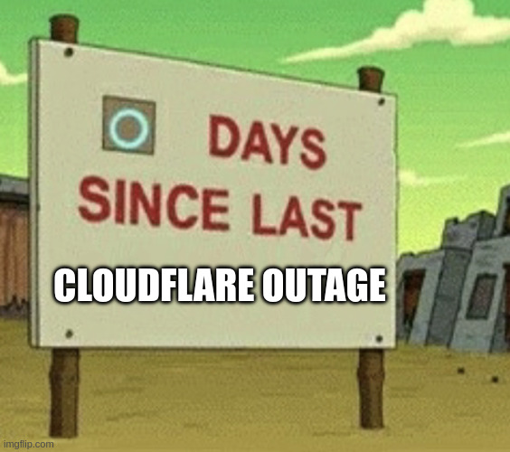

# Mirrorwatch

Refer to the file timestamp for the date of capture.

## Files
- [result.csv](result.csv)
- [result.fods](result.fods)

## Datasource
- https://mirrormanager.fedoraproject.org/mirrors
- whois.radb.net

## What's going on?

- https://controld.com/blog/biggest-cloudflare-outages/

Growing number of operators are slapping CDN(Cloudflare, CloudFront) with [tier
1 mirrors](https://fedoraproject.org/wiki/Infrastructure/Mirroring/Tiering) as
origin and calling it a mirror. We're walking into a bleak future where the
internet is operated by fewer orgs. As a dire side effect, the internet is
becoming more susceptible to outages of large CDN providers.

Seriously, this has to stop.

CDNs are okay in general. But it comes with a hidden cost: not everyone can
afford anycast networks. CDNs are often run by only a few large organizations.
Then the bandwagon effect kicks in - before you know it, 80% of the internet
traffic is handled by Cloudflare. Now, THAT is NOT okay.

3% might not seem like a lot, but in some geographical locations, the share of
Cloudflare-backed mirrors are over 30% or even 50%. Most distros organically
implement their own [homegrown
GSLB](https://github.com/adrianreber/mirrorlist-server)s that often use
geolocation metadata when directing package managers to mirror sites. In case of
outage, the chances of package managers ending up pulling packages from
suboptimal mirrors are higher in such regions.

### CDNs are not suitable for Fedora mirror
Another problem is that developer-oriented distros like Fedora and Gentoo
require mirrors with fast sync rate as the source packages are updated rapidly.

Unlike traditional mirrors(many small independent mirror sites operated by
Govts, universities, tech companies, etc), CDNs are not dedicated to serving
only package mirroring but usually shared with other users like websites and VOD
services. For this reason, CDNs seem to be slow to catch up with aforementioned
distro package updates.

## TODO
- Implement other distros
- Implement exclude filter in [mirrorlist-server](https://github.com/adrianreber/mirrorlist-server)

Most distros encourage people to run public mirrors and this attracted some
hobbyst server admins without knowledge skills in maintaining critical
infrastructure like package mirrors. The way the `metalink=` is currently
implemented, there's no feasible way for end users to avoid such low quality
mirrors. Implementing exclusion option/filter in query param should solve the
issue.

- https://github.com/fedora-infra/mirrormanager2/pull/172/files
- https://github.com/adrianreber/mirrorlist-server/blob/0ca3fde3907619e6daa3179b0ce2f3230dfa8150/src/bin/mirrorlist-server.rs#L311
